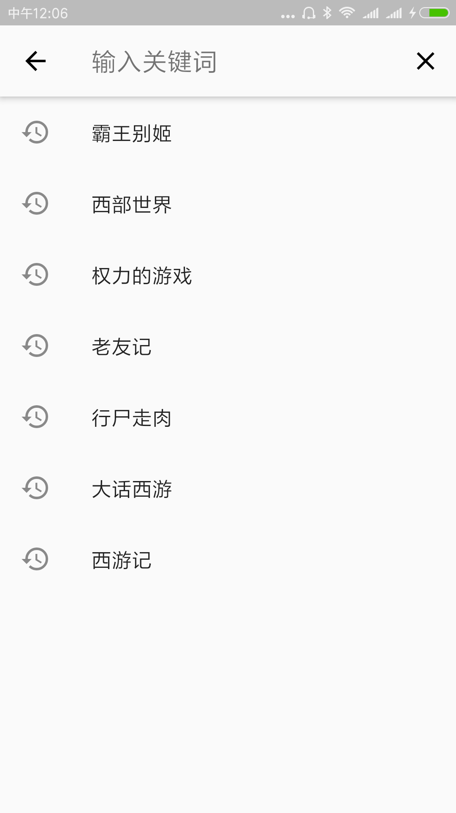

# 木易

---
- 来自互联网的影视数据,使用Flutter构建，支持Android,IOS
- [GitHub](https://github.com/ruihuancao/flutter_movie)
- [Flutter](https://flutter.io/).
- [Google Play](https://play.google.com/store/apps/details?id=com.ruihuan.flutter.fluttermovie).

# 功能

- [x] 影视列表
- [x] 影视搜索
- [x] 视频播放
- [ ] 登录
- [ ] 主题设置
- [ ] 列表优化
- [ ] 缓存

# 说明
1. 数据取自互联网
2. 本项目仅供学习交流使用，如有侵权，立即删除

<!--#### 截图-->
<!--
-->
    <!---->
    <!---->
    <!---->
<!--
-->
<!--
-->
    <!---->
    <!---->
<!--
-->